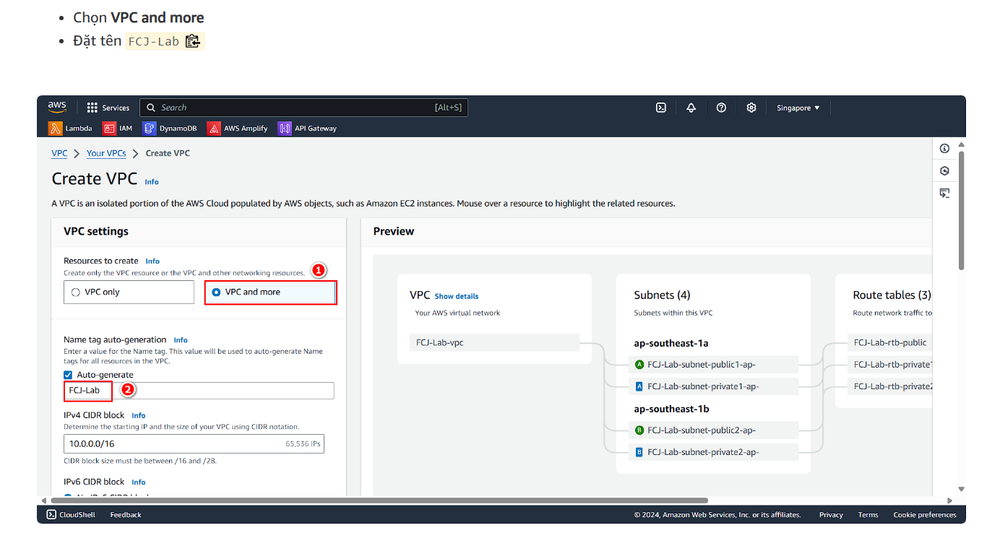

### Purporse

https://000015.awsstudygroup.com/vi/1-introduction/

Deploying a full web app using: Docker inside EC2 + Nginx, RDS (MySql), especially the network settings.


- RDS is a managed database service provided by AWS, but it don't have OS level, we will have a way to connect to RDS from EC2 or from our local machine, or run SQL script in RDS page.
- Nginx in this case only act as a reverse proxy, it will forward request to the servers.
  Reverse proxy is to hide the servers, which means outside only see the proxy IP, not the servers' IPs.
- Docker to contain servers and proxy, so we just need to docker compose up, and 3 containers will be up and running.
- We will have public security group for EC2, and private security group + subnet for RDS. An internet gateway is created automatically when we create a VPC with public and private subnets.

### Nginx + Docker compose

Project structure:


- nginx.conf: Nginx configuration file, it will forward request to servers. '/api' for BE, '/' for FE.

```
upstream frontend {
    server frontend:5173;
}

upstream backend {
    server backend:5000;
}

server {
    listen 80;

    location / {
        proxy_pass http://frontend;
    }

    location /sockjs-node {
        proxy_pass http://frontend;
        proxy_http_version 1.1;
        proxy_set_header Upgrade $http_upgrade;
        proxy_set_header Connection "Upgrade";
    }

    location /api {
        proxy_pass http://backend;
    }

    location /uploads {
        proxy_pass http://backend/uploads;
    }
}
```

upstream: define a group of servers, here we have 2 groups: frontend and backend.

server: define a virtual server, this nginx server, here we have only one server listen on port 80.

location: define how nginx should process requests for different URL paths.

proxy_pass: forward request to the defined upstream group.

proxy_http_version and proxy_set_header: these directives are used to handle WebSocket connections properly. Without these settings, WebSocket connections might fail because they require an upgrade from HTTP to WebSocket protocol.

- docker-compose.app.yml: Docker compose file, it will create 3 containers: Nginx, fe, be. It will read env file for environment variables.

- Dockerfile: Dockerfiles will be inside fe, be, nginx folders.

### Setup network for RDS

When we create VPC, chose VPC and more, which will have multi-region config (2 AZ, 2 public, 2 private subnets, 1 internet gateway, 1 nat gateway).



- Public sg: need to add inbound rule: HTTP 80, SSH 22, HTTPS 443, Custom TCP port range 3000 (for nginx external port, we will http://ec2-public-ip:3000 later to open the web).

Even though HTTP and HTTPS are on top of TCP, but we need to add TCP separately, because HTTP is always on port 80, HTTPS is always on port 443, but our nginx is on port 3000, so we need to add TCP 3000.

- DB sg: inbound rule: MySQL/Aurora 3306 source from public sg.

Go to RDS page, we need to add subnet group, this is to failover, which means if one AZ goes down, it can failover to another AZ, so you need to provide at least 2 subnets in different AZs.

- Standard retention period is 7 days, which means if we delete RDS, we can restore it within 7 days, after that it will be deleted permanently.

### Run Docker on EC2:

We will use ubuntu server 22.04 LTS.

Make sure latest version of ubuntu:

```
sudo apt-get update
sudo apt-get upgrade
```

Install docker and docker compose:

```
# Add Docker's official GPG key:
sudo apt-get update
sudo apt-get install ca-certificates curl
sudo install -m 0755 -d /etc/apt/keyrings
sudo curl -fsSL https://download.docker.com/linux/ubuntu/gpg -o /etc/apt/keyrings/docker.asc
sudo chmod a+r /etc/apt/keyrings/docker.asc

# Add the repository to Apt sources:
echo \
  "deb [arch=$(dpkg --print-architecture) signed-by=/etc/apt/keyrings/docker.asc] https://download.docker.com/linux/ubuntu \
  $(. /etc/os-release && echo "$VERSION_CODENAME") stable" | \
  sudo tee /etc/apt/sources.list.d/docker.list > /dev/null
sudo apt-get update

```

Install Docker Engine, CLI, containerd, Docker Compose plugins: buildx is for multi architecture builds (like arm64, amd64), cli to run docker cmd, container.io is the container runtime for ce, compose plugin for docker compose cmds.

```
 sudo apt-get install docker-ce docker-ce-cli containerd.io docker-buildx-plugin docker-compose-plugin
```

Because our RDS is in private subnet, so if we want to CLI into RDS, we must do it from our EC2 instance:

```
mysql -h "rds-endpoint" -u admin -p
```

run script:

```
source /home/ubuntu/aws-fcj-container-app/database/init.sql
```

Run our servers with docker compose:

```
sudo docker compose -f docker-compose.app.yml up -d
```

Or we can run each container separately, and connect them via a docker network:

```
sudo docker network create my-network
sudo docker run -p 3000:80 --network my-network --name frontend frontend-image
sudo docker run -p 5000:5000 --network my-network --name backend backend-image
```

In docker compose approach, we use nginx, so we don't need docker network, because nginx will connect to the containers via the service names defined in docker compose file. If we use docker network, to hit the backend server, we need to use backend:5000, not localhost:5000.

### Clean up

After follow clean up steps in the original awsstudygroup link we stil need to watch out:

- RDS snapshot (~0.01 USD per day)

  

- RDS subnet group

- RDS system retained snapshot

  

- RDS snapshot > systems, we cannot delete this manually, it will be deleted automatically after we delete retained backup (above).

  

Make sure nothing left:


