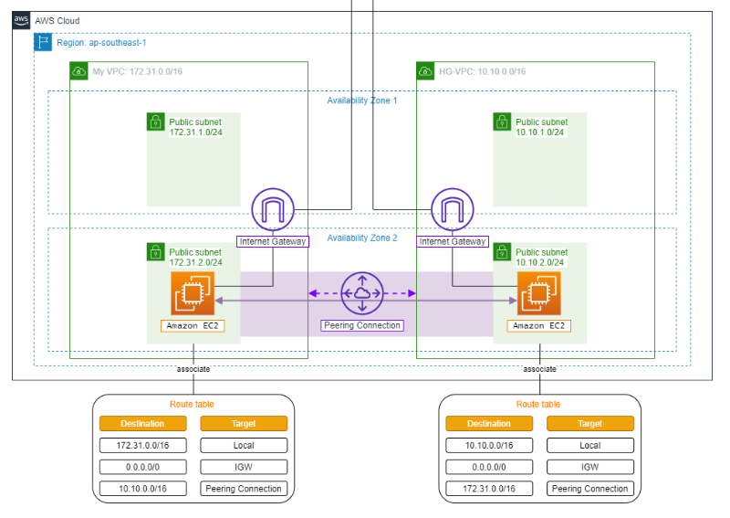
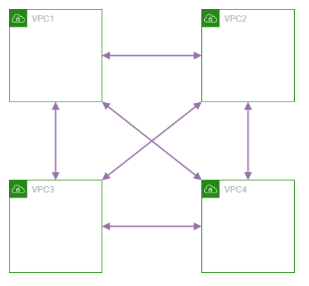
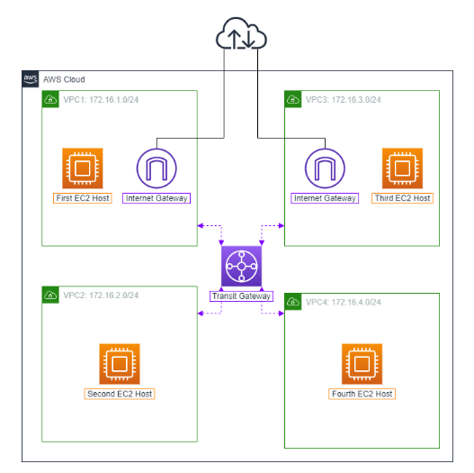

### Table of Contents

- [Purpose](#purpose)
- [Security Group vs NACL](#security-group-vs-nacl)
- [VPC Peering](#vpc-peering)
- [Transit Gateway](#transit-gateway)

### Purpose

https://000019.awsstudygroup.com/vi/

In real world, we may need 2 VPC on same 2 AZs to:

- Isolate different environments (e.g., production vs. development)
- Isolate different business units (e.g., marketing vs. finance)
- This lab is to learn, so in real world, VPC peering can work with different AZs (different accounts, regions)

And we will not apply this architecture in multi-tenant architecture, because AWS has soft limit 5 VPC per region, and number of tenants is increasing all the time. (They use Shared VPC pool instead)



Today we will find a way for 2 VPC to communicate with each other without going through internet - using VPC Peering. From EC2-VPC1 we can ping EC2-VPC2 via private IP address.

Also, in this lab, we will learn about NACL (Network Access Control List) - a stateless firewall at subnet level.

### Security Group vs NACL

You want to allow SSH from your IP address to your EC2 instance only, you can do it with Security Group or NACL.

With Security Group, it only applies on the EC2 instance, so if you have 10 EC2 instances, you need to add the rule to all 10 Security Groups.

With NACL, it applies on the subnet level, so if you have 10 EC2 instances in the same subnet, you only need to add the rule once to the NACL.

In depth compare:

| Feature          | Security Group    | NACL                                 |
| ---------------- | ----------------- | ------------------------------------ |
| Level            | Instance/ENI      | Subnet                               |
| State            | Stateful          | Stateless                            |
| Rules            | Allow only        | Allow + Deny                         |
| Rule evaluation  | All rules checked | Rules checked by order (rule number) |
| Response traffic | Auto allowed      | Need explicit rule                   |
| Default          | Deny all inbound  | Allow all                            |
| Max rules        | 60 per SG         | 20 per NACL (can increase to 40)     |

- Stateful: if a request successfully goes in, it can go out.
- Stateless: have rule for request, another for response.

NACL have order, for example we have traffic from 10.0.1.50, and here are rules:

```
Rule 100: Allow HTTP from 10.0.0.0/16
Rule 200: Deny HTTP from 10.0.1.0/24
Rule *:   Deny all (default)
Result: ALLOWED (we apply rule 100 first)
```

```
Rule 100: Deny HTTP from 10.0.1.0/24
Rule 200: Allow HTTP from 10.0.0.0/16
Rule *:   Deny all

Traffic from 10.0.1.50:
1. Check Rule 100 → Match! Deny ❌
2. Stop

Result: DENIED
```

In summary, we use SG whenever creates instances (EC2, RDS, etc), and use NACL to allow only our trusted IP ranges to access our subnets.

### VPC Peering

After create VPC Peering connection profile, you need to Actions -> Accept Request (you stil cannot ping yet).

Then, Actions -> Edit DNS Settings -> you need to turn on Cross Peer DNS.

From EC2-VPC1, you can ping EC2-VPC2 via public IPv4 DNS, if it returns private IP address it means DNS peering works.

### Transit Gateway

https://000020.awsstudygroup.com/vi/3-transitgateway/

It took 1 peer to connect 2 VPCs, with 4 VPCs, we need 6 peers:



What if we have a lot of VPCs ? We can have a router right to fix this right?



Note: Transit Gateway is not cheap, and it can connect on-premise network as well.

Steps to create TGW:

1. Create Transit Gateway

2. Create Transit Gateway Attachment for each VPC

3. Config Route Table of each VPC to point to Transit Gateway (you need to add Association and Propagation in Transit Gateway Route Table as well)

- Transit Gateway Route Table is like a big switch, it knows which VPC is in which direction.
- TGW Route Table's Association: add 4 VPC into it, this is to tell TGW which VPCs are connected to it.
- TGW Route Table's Propagation: add 4 VPC into it, this is to tell TGW to learn routes from these VPCs. Which means, if you don't add this, you need to manually add routes ("Routes" → Click "Create static route") to TGW Route Table, for example VPC-1 10.0.1.0/24 → VPC-1 Attachment, VPC-2 10.0.2.0/24 → VPC-2 Attachment...
- You need attachments and tell what are the routes, only then traffic inside TGW can flow.

But we stil cannot ping yet, only traffic in TGW can flow, but trafic from VPC to TGW is not flowing yet. So we need to add TGW to VPCs' Route Tables (4 VPCs Route Tables will target to the same TGW - so they will have same config).

From one VPC, you can ping another VPC by private IP address.
