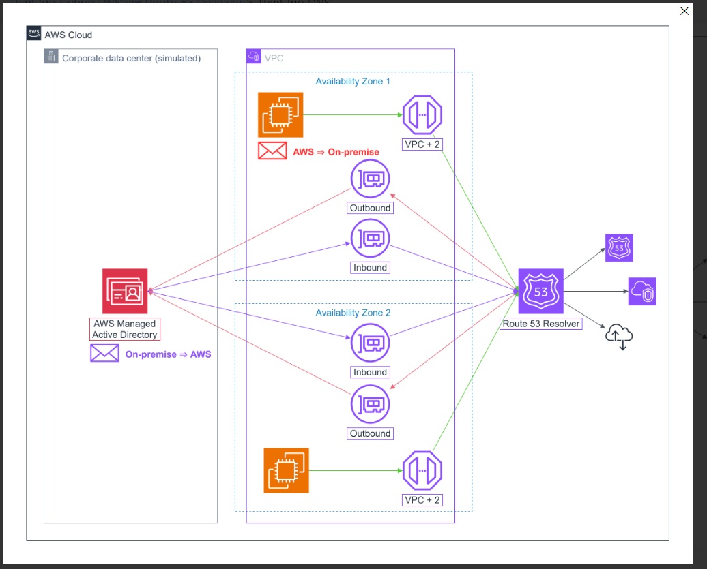
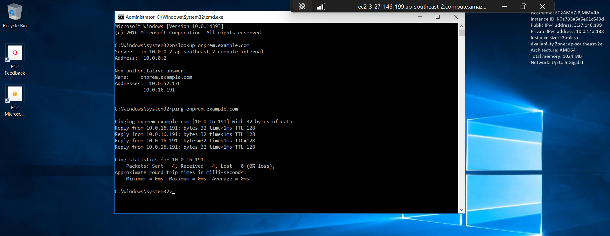

### Purpose

The purpose of this lab is to set up a hybrid DNS environment that integrates both on-premises and cloud-based DNS services. This setup will allow for seamless resolution of domain names across different environments, enhancing accessibility and reliability for users and applications.

For example: A healthcare organization might use core server on their premises (their local host servers).
But their are some services they can host in the cloud AWS.
So how can they communicate?

### Overall Architecture

- Remote Desktop Gateway (RDG) server is a EC2 instance that allows Windows desktop remote access.
- AWS Managed Active Directory will be on premises server.
- Route 53 Resolver will be used to forward DNS queries between the on-premises network and the AWS cloud.

### Result

Able to ping from RDG (EC2) to AD (on-premises)

- 10.0.0.2 - EC2's VPC + 2 - DNS server (reserved for Amazon-provided DNS)
- We have 2 addresses for onprem.example.com, because when we config we add 2 availability zones, so it will create 2 IP addresses for High Availability.
